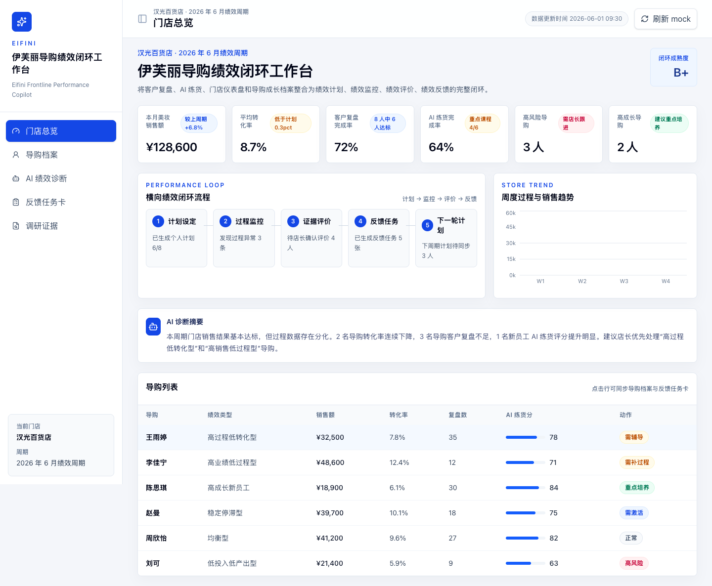
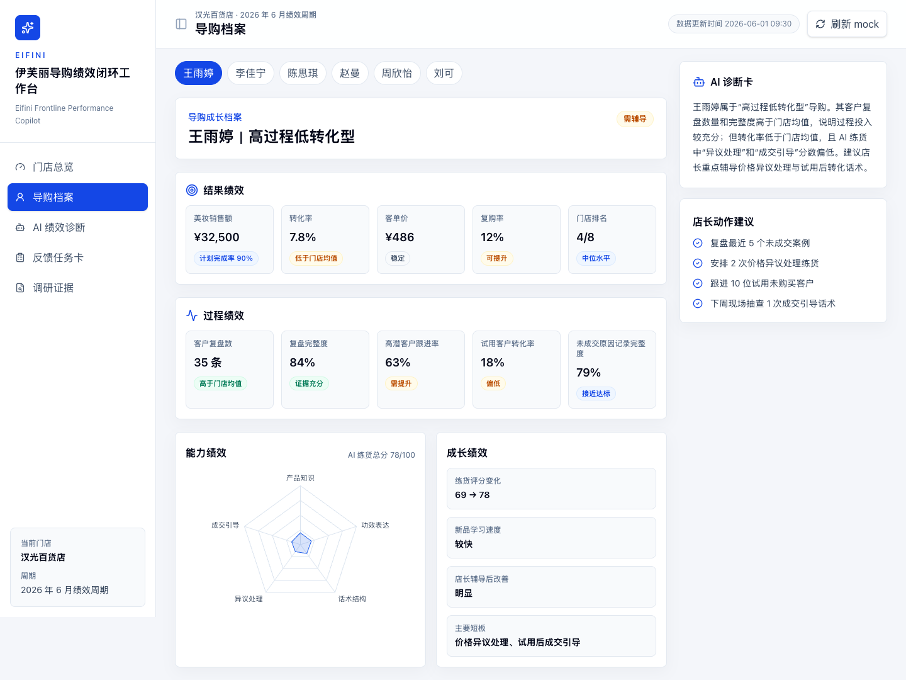
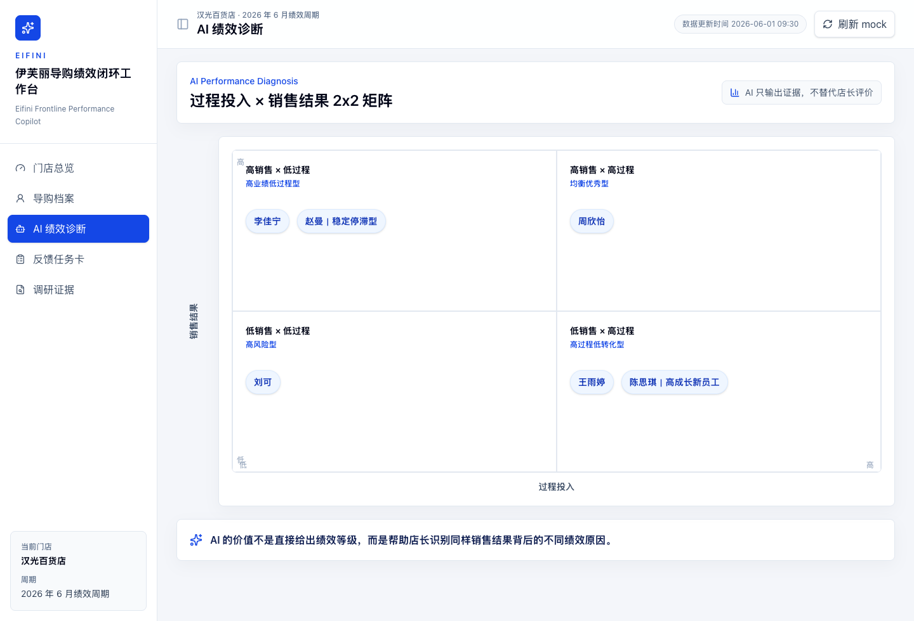
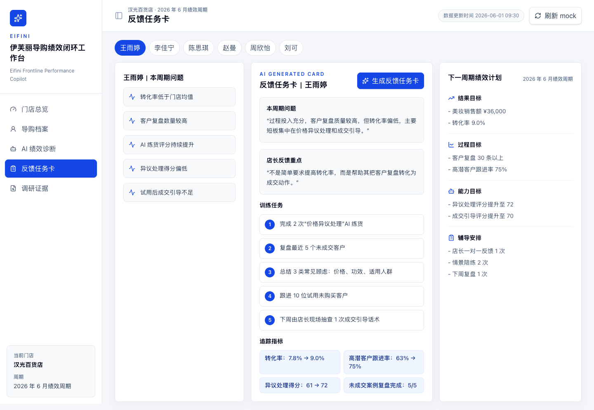
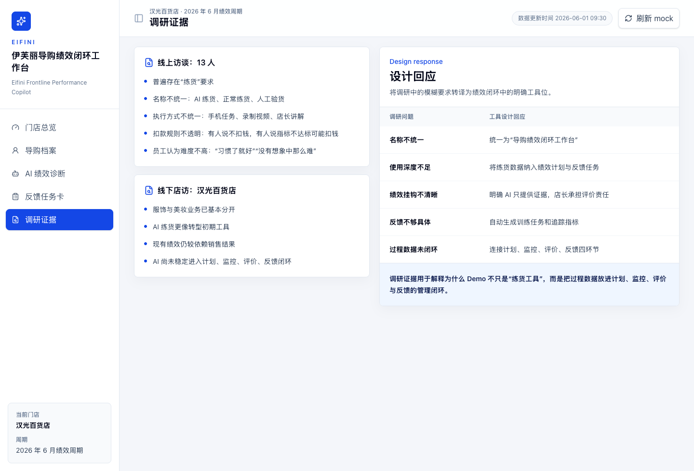

# 伊芙丽导购绩效闭环工作台

Eifini Frontline Performance Copilot

一个高保真前端 Demo，用于展示导购绩效管理升级原型。Demo 将客户复盘、AI 练货、门店仪表盘和导购成长档案整合为完整绩效管理闭环：绩效计划、绩效监控、绩效评价、绩效反馈。

## Tech Stack

- React + Vite + TypeScript
- Tailwind CSS
- Recharts
- lucide-react
- 本地 mock data，无后端、无数据库、无真实 AI API

## Run Locally

```bash
npm install
npm run dev
```

打开本地地址：

```text
http://127.0.0.1:5173/
```

## Build

```bash
npm run build
```

## Demo Pages

- 门店总览
- 导购档案
- AI 绩效诊断
- 反馈任务卡
- 调研证据

## Screenshots

截图位于 `screenshots/` 目录，均为 1440px 宽原比例导出。










